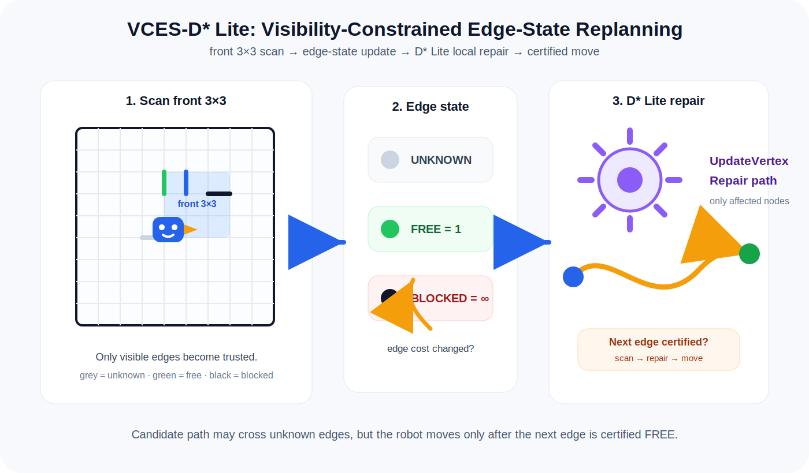

# VCES-D* Lite

**VCES-D\* Lite** = **Visibility-Constrained Edge-State D\* Lite Replanning**  
中文名：**视野约束边状态 D\* Lite 在线重规划方法**

This project implements a compact Python 3.9 planner for a 9×9 edge-obstacle maze.  
The robot maintains an edge-state map, scans a limited near-field front region, and repairs its path with a D* Lite-style incremental replanning core.



## What problem does it solve?

The map has 81 cells numbered left-to-right and top-to-bottom. Obstacles are placed on **edges between cells**, not inside cells. The robot cannot see the full map. It must:

1. plan a candidate path;
2. scan only its **front 3×3 near-field visible region**;
3. update edge states: `UNKNOWN / FREE / BLOCKED`;
4. repair the path when an edge cost changes;
5. move only through certified `FREE` edges.

## Method name

```text
VCES-D* Lite
Visibility-Constrained Edge-State D* Lite Replanning
视野约束边状态 D* Lite 在线重规划方法
```

## Core idea

```text
front 3×3 visibility scan
        ↓
edge state update: UNKNOWN / FREE / BLOCKED
        ↓
edge cost update: unknown/free = finite, blocked = ∞
        ↓
D* Lite-style affected-vertex update
        ↓
repair candidate path
        ↓
move one certified edge
```

## Installation

No third-party runtime dependency is required.

```bash
git clone <your-repo-url>
cd vces-dstar-lite
python3.9 -m venv .venv
source .venv/bin/activate
python -m pip install -e .
```

## Quick demo

Single target:

```bash
python -m vces_dstar_lite --start 1 --goals 38 --seed 7
```

Default sequence task:

```bash
python -m vces_dstar_lite --start 1 --goals 14,44,68,38 --seed 11
```

Console entry point after installation:

```bash
vces-dstar-lite --start 1 --goals 14,44,68,38 --seed 11
```

## Python API

```python
from vces_dstar_lite import EdgeState, MazeNavigator

nav = MazeNavigator(start=1, goals=[14, 44, 68, 38])

action, next_cell, msg = nav.decide_next_action()

if action == "SCAN":
    observations = [
        # (edge_id, EdgeState.FREE),
        # (edge_id, EdgeState.BLOCKED),
    ]
    changed_edges = nav.apply_observations(observations)

elif action == "MOVE":
    # Send motion command to your controller.
    # After the robot reaches the center of next_cell:
    nav.confirm_move(next_cell)
```

## ROS1 integration idea

This repository is intentionally pure Python. In ROS1, wrap `MazeNavigator` inside a `rospy` node:

```text
sensor / vision node
        ↓ observed edge states
planner node: MazeNavigator
        ↓ next cell command
motion controller / STM32
        ↓ arrival confirmation
planner node updates current cell
```

See `ros1/maze_planner_node.py` for a minimal skeleton.

## Repository layout

```text
vces-dstar-lite/
├── assets/
│   ├── method_cartoon.svg
│   └── method_cartoon.png
├── docs/
│   └── METHOD.md
├── examples/
│   └── run_demo.py
├── ros1/
│   ├── README.md
│   └── maze_planner_node.py
├── src/
│   └── vces_dstar_lite/
│       ├── __init__.py
│       ├── __main__.py
│       └── core.py
├── tests/
│   └── test_core.py
├── pyproject.toml
├── LICENSE
└── README.md
```

## Notes

For a 9×9 maze, full A* replanning is already fast enough.  
VCES-D* Lite is useful because it makes the method cleaner and more scalable: only edge-cost changes trigger local path repair.
